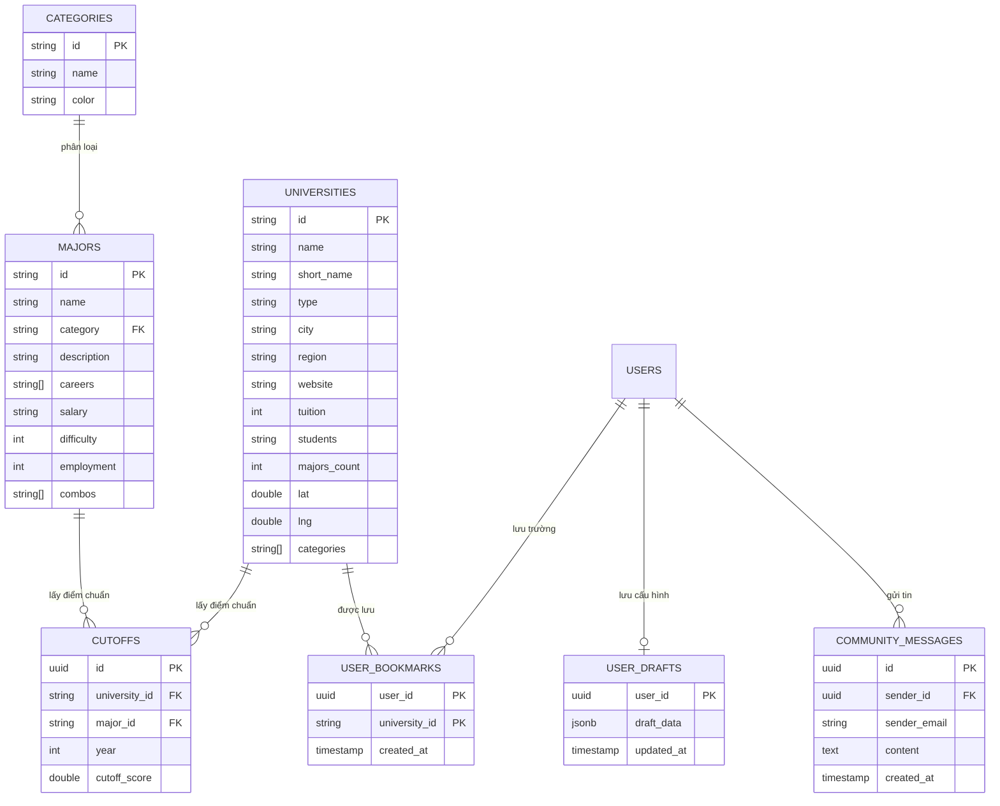

# BÁO CÁO CHI TIẾT DỰ ÁN UNIMATCH
## Hệ Thống Tư Vấn Nguyện Vọng & Hỗ Trợ Tuyển Sinh Dành Cho Gen-Z

---

## 1. TỔNG QUAN DỰ ÁN (OVERVIEW)

### 1.1. Giới thiệu chung
**UniMatch** là một nền tảng ứng dụng web hiện đại hướng tới đối tượng học sinh THPT (thế hệ Gen-Z) chuẩn bị bước vào kỳ tuyển sinh Đại học. Khác với các danh bạ thông tin đại học truyền thống, UniMatch mang tính đột phá thông qua:
*   **Chiến lược nguyện vọng thông minh 30/50/20:** Phân chia danh mục đăng ký nguyện vọng thành 3 nhóm khoa học:
    *   **An toàn (Safe - 30%):** Nhóm trường có điểm chuẩn các năm trước thấp hơn hẳn điểm thi của thí sinh (Tỷ lệ đỗ cực cao).
    *   **Phù hợp (Fit - 50%):** Nhóm trường có điểm chuẩn tiệm cận với điểm thi của thí sinh (Khả năng đỗ trung bình - cao).
    *   **Mơ ước (Reach - 20%):** Nhóm trường lấy điểm cao hơn một chút so với điểm thi hiện tại (Thử thách và bứt phá).
*   **Phong cách thiết kế Neo-Brutalism:** Xu hướng thiết kế đương đại kết hợp các khối màu có độ tương phản cực cao, viền đen dày đậm nét, hình khối cá tính và các hiệu ứng động (Micro-animations) bắt mắt, tạo cảm giác năng động, trẻ trung.

### 1.2. Mục tiêu dự án
*   Giúp thí sinh tự động hóa việc tính toán tổ hợp môn và tra cứu kết quả nguyện vọng.
*   Cung cấp tính năng so sánh, lưu trữ các trường đại học yêu thích trực tuyến.
*   Tạo dựng kênh tương tác cộng đồng thời gian thực để trao đổi thông tin tuyển sinh.
*   Tích hợp bản đồ tọa độ địa lý và cập nhật dòng thời gian tin tức chính thống từ Bộ Giáo dục & Đào tạo.

---

## 2. KIẾN TRÚC & CÔNG NGHỆ SỬ DỤNG (TECHNOLOGY STACK)

Dự án áp dụng mô hình phát triển phần mềm Full-Stack hiện đại với các công nghệ lõi:

| Thành phần | Công nghệ lõi | Công dụng cụ thể |
| :--- | :--- | :--- |
| **Framework Frontend** | **Next.js 14+ (App Router)** | Xây dựng ứng dụng đơn trang (SPA) tối ưu hiệu năng nhờ Server Component kết hợp Client Component (`use client`), quản lý đường dẫn (routing) trực quan qua thư mục. |
| **Backend & Cloud Services** | **Supabase (BaaS - Backend as a Service)** | Cung cấp hệ thống quản lý cơ sở dữ liệu đám mây, tích hợp các tính năng: Auth (Xác thực người dùng), Database PostgreSQL, Real-time Subscription cho Box Chat. |
| **Cơ sở dữ liệu** | **PostgreSQL (Supabase Cloud)** | Lưu trữ dữ liệu về danh sách các trường đại học, ngành học, điểm chuẩn qua các năm, danh sách bookmark, và tin nhắn trò chuyện cộng đồng. |
| **Giao diện & Thiết kế** | **Vanilla CSS & CSS Variables** | Tạo hệ thống style Neo-Brutalism linh hoạt mà không cần sử dụng thư viện CSS cồng kềnh. |
| **Thư viện Hiệu ứng** | **AOS (Animate on Scroll)** | Kích hoạt các hiệu ứng trượt, xoay và mờ dần khi người dùng cuộn trang. |

---

## 3. CƠ SỞ DỮ LIỆU & QUAN HỆ BẢNG (DATABASE SCHEMA)

Dữ liệu được lưu trữ trên PostgreSQL tại Supabase với mô hình cơ sở dữ liệu quan hệ chặt chẽ:



---

## 4. CHI TIẾT CÁC CHỨC NĂNG CHÍNH (KEY FEATURES)

### 4.1. Máy tính Điểm & Lọc nguyện vọng 30/50/20
*   **Giao diện nhập điểm:** Cho phép chọn khối thi (A00, A01, D01, C00...) và tự động cập nhật các ô nhập điểm theo môn tương ứng.
*   **Thuật toán phân loại:** So sánh tổng điểm tổ hợp của học sinh với điểm chuẩn năm ngoái của các trường đại học trong cơ sở dữ liệu và chia kết quả thành 3 nhóm (An toàn, Phù hợp, Mơ ước) kèm biểu đồ phần trăm định hướng.

### 4.2. Tra cứu & So sánh trường học (Universities Directory)
*   **Bộ lọc đa năng:** Tìm kiếm theo tên/mã trường, lọc theo loại trường (Công lập/Tư thục), theo khu vực (Bắc/Trung/Nam) và theo nhóm ngành giảng dạy.
*   **Chức năng So sánh:** Người dùng có thể đưa tối đa 3 trường vào thanh so sánh (dock) để hiển thị bảng đối chiếu trực quan về học phí, quy mô sinh viên, số lượng ngành và loại hình đào tạo.

### 4.3. Đồng bộ hóa Yêu thích (Bookmarks) "Local-First"
*   **Hoạt động:** Khi người dùng chưa đăng nhập, các trường đã lưu (bookmarks) sẽ được lưu tại `localStorage` của trình duyệt. 
*   **Đồng bộ đám mây:** Ngay khi người dùng đăng nhập bằng tài khoản Google, hệ thống tự động gộp (merge) dữ liệu từ `localStorage` lên bảng `user_bookmarks` trên Supabase, đảm bảo thí sinh không bị mất dữ liệu yêu thích khi đổi thiết bị.

### 4.4. Trò chuyện cộng đồng thời gian thực (Real-time Chat)
*   Tận dụng tính năng **Supabase Realtime Channel** để tự động đồng bộ và hiển thị tin nhắn mới ngay lập tức mà không cần tải lại trang.
*   Áp dụng RLS (Row Level Security): Người dùng chưa đăng nhập chỉ được quyền đọc tin nhắn công khai; chỉ người dùng đã xác thực (đăng nhập) mới có thể gửi tin nhắn mới.

### 4.5. Trang Tin tức tuyển sinh với Bản đồ tương tác
*   **Nhúng Fanpage Facebook:** Tích hợp trực tiếp bảng tin (timeline) trang chính thống của Bộ Giáo dục & Đào tạo.
*   **Bản đồ định vị:** Sử dụng bản đồ tương tác để chỉ ra vị trí chính xác của các trường đại học.

---

## 5. CẤU TRÚC THƯ MỤC & CÔNG DỤNG CÁC FILE

Dưới đây là sơ đồ cấu trúc mã nguồn chính và vai trò của từng file:

```text
BestWebDesign/
├── app/                           # Thư mục chính của Next.js (App Router)
│   ├── api/                       # API Routes (Serverless Functions)
│   │   ├── universities/          # API lấy danh sách trường học từ database
│   │   │   └── route.js
│   │   └── verify-session/        # API xác minh phiên đăng nhập của Supabase
│   │       └── route.js
│   ├── chat/                      # Module Phòng trò chuyện cộng đồng
│   │   └── page.js                # Logic và giao diện hộp chat thời gian thực
│   ├── majors/                    # Module Tra cứu Ngành học
│   │   └── page.js
│   ├── map/                       # Module Bản đồ địa lý trường đại học
│   │   └── page.js
│   ├── news/                      # Module Tin tức tuyển sinh
│   │   └── page.js                # Nhúng Fanpage Facebook, xử lý sticker và cuộn
│   ├── layout.js                  # Bố cục chung toàn ứng dụng (import Font, CSS chung, Header, Footer)
│   └── page.js                    # Trang chủ (Máy tính tính điểm và thuật toán lọc nguyện vọng)
├── components/                    # Các thành phần tái sử dụng (Shared Components)
│   ├── AosInit.jsx                # Khởi tạo thư viện hiệu ứng AOS cuộn trang
│   ├── DynamicBackground.jsx      # Thiết kế lưới chấm (Dot Grid) Neo-Brutalism động ở nền
│   ├── Footer.jsx                 # Chân trang (Thông tin bản quyền và liên kết nhanh)
│   ├── Header.jsx                 # Thanh điều hướng trên cùng (Menu và nút đăng nhập)
│   └── SmoothScrollProvider.jsx   # Cung cấp hiệu ứng cuộn mượt cho toàn trang
├── css/                           # Tập hợp các file định kiểu giao diện
│   ├── base.css                   # Định nghĩa CSS variables, reset kiểu mặc định
│   ├── components.css             # Định kiểu cho nút bấm, thẻ bài viết, các hiệu ứng chung
│   ├── layout.css                 # Quản lý lưới và khung hiển thị (flex, grid)
│   ├── pages.css                  # CSS riêng cho trang tin tức, sticker, bản so sánh trường
│   ├── responsive.css             # Xử lý tương thích màn hình điện thoại, máy tính bảng
│   └── style.css                  # File CSS gốc liên kết tất cả các file css con
├── lib/                           # Cấu hình thư viện bên thứ ba
│   └── supabase.js                # Khởi tạo kết nối Supabase Client (sử dụng API Key)
├── scripts/                       # Các kịch bản chạy lệnh thủ công (Utilities)
│   ├── check-db.js                # Kiểm tra kết nối tới Database Supabase Cloud
│   └── seed-supabase.js           # Kịch bản nạp dữ liệu ban đầu cho database (seeding)
├── index.html                     # Bản thiết kế HTML thô ban đầu của dự án
├── supabase-schema.sql            # Bản thiết kế lược đồ bảng SQL chạy trên Supabase
└── package.json                   # Liệt kê thư viện phụ thuộc và các câu lệnh vận hành dự án
```

---

## 6. CÁC KỸ THUẬT TỐI ƯU HÓA ĐẶC SẮC (HIGHLIGHTED TECHNIQUES)

Trong quá trình hoàn thiện giao diện cho trang **Tin tức (`app/news/page.js`)**, một số kỹ thuật tương tác nâng cao đã được nghiên cứu và thực thi:

### 6.1. Thuật toán theo dõi chuột toàn cục khóa cuộn trang (Global Mouse Tracking Scroll Lock)
*   **Vấn đề:** Khi nhúng iframe Fanpage của Facebook, nếu người dùng rê chuột vào iframe để cuộn tin tức thì sự kiện cuộn sẽ dễ bị tràn ra ngoài (scroll chaining), kéo trang web chính chạy theo. Ngoài ra, việc lắng nghe `mouseleave` thông thường trên thẻ chứa sẽ bị kích hoạt sai lệch khi con trỏ đi từ trang chính vào bên trong tài liệu bảo mật của iframe (cross-origin iframe).
*   **Giải pháp:**
    *   Sử dụng một React `useEffect` đăng ký lắng nghe sự kiện `mousemove` toàn cục trên `window`.
    *   Trong bộ xử lý, tiến hành lấy tọa độ khung hình của hộp chứa card bằng `getBoundingClientRect()`.
    *   So khớp tọa độ `clientX` và `clientY` của con trỏ chuột. Nếu con trỏ chuột nằm trong phạm vi hình học của card, hệ thống sẽ thực hiện khóa cuộn trang chính (`body { overflow: hidden }`). Ngay khi con trỏ chuột đi ra ngoài biên của card, trang chính lập tức được mở khóa cuộn lại bình thường (`overflow: unset`).
    *   Kỹ thuật này hoạt động chính xác 100% trên mọi trình duyệt mà không sợ xung đột bảo mật cross-origin với iframe Facebook.

### 6.2. Cuộn tích hợp tiêu đề Iframe và Scrollbar Neo-Brutalism Custom
*   **Vấn đề:** Mặc định khi Facebook Page Plugin cuộn nội bộ, nó sẽ giữ cố định (sticky) phần Header (logo và tiêu đề fanpage) ở đầu widget. Người dùng mong muốn Header này cuộn biến mất lên trên giống như các bài viết thông thường để tiết kiệm không gian đọc.
*   **Giải pháp:**
    *   Thiết lập chiều cao đầy đủ của iframe lên `1200px` (tránh để Facebook tự động chia nhỏ chiều cao và tạo thanh cuộn riêng).
    *   Sử dụng một khung chứa bao ngoài (wrapper) với thuộc tính `overflowY: 'auto'`. Điều này cho phép cuộn toàn bộ khối iframe lên trên, làm cho phần Header của Fanpage cuộn biến mất một cách tự nhiên.
    *   Để tránh giao diện thô cứng của thanh cuộn hệ thống, CSS tùy biến (`::-webkit-scrollbar`) đã được thêm vào lớp `.facebook-timeline-wrapper`, tạo ra thanh cuộn màu vàng đồng bộ có viền đen đậm mang phong cách Brutalist sắc nét.

### 6.3. Xử lý hiển thị Sticker tuyệt đối (Absolute Positioning cho Sticker)
*   Các sticker Gen-Z trang trí rìa màn hình được điều chỉnh từ `position: fixed` sang `position: absolute` so với khung chính của trang. Nhờ vậy, khi người dùng cuộn trang xuống phần chân trang (Footer), các sticker này sẽ tự động cuộn lên trên cùng nội dung trang chính, không đè hay che lấp lên các liên kết quan trọng của Footer.

---

## 7. KẾT LUẬN

Dự án **UniMatch** đã thể hiện xuất sắc sự kết hợp giữa kỹ thuật lập trình ứng dụng Next.js hiện đại, quản lý dữ liệu đám mây Supabase và nghệ thuật thiết kế giao diện Neo-Brutalism cá tính. Hệ thống đáp ứng đầy đủ yêu cầu về mặt chức năng tính toán, tính an toàn dữ liệu cũng như tính thẩm mỹ cao, mang lại trải nghiệm tối ưu nhất cho thế hệ thí sinh Gen-Z.
